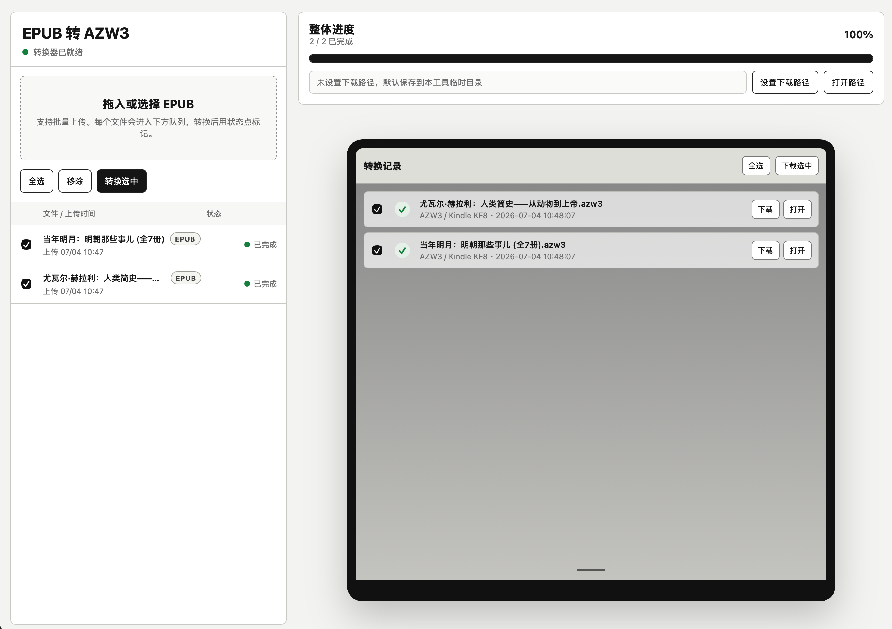

# Cliente local EPUB a AZW3

Una herramienta visual local para convertir archivos EPUB a AZW3 / Kindle KF8 con Calibre. Permite carga por lotes, progreso de conversión, historial, descarga individual y descarga ZIP de varios resultados.

## Vista de la interfaz



## Funciones

- Conversión local de EPUB a AZW3
- Carga por lotes con arrastrar y soltar o selector de archivos
- Cola con nombre, hora de carga, tipo y estado
- Progreso general
- Historial con estilo Kindle
- Descarga individual o ZIP
- Carpeta de salida configurable
- Compatible con macOS y Windows

## Requisitos

- Python 3
- Calibre

macOS:

```zsh
brew install --cask calibre
```

Windows:

```bat
winget install --id calibre.calibre -e
```

## Ejecutar

macOS: haz doble clic en `start.command`.

Windows: haz doble clic en `start.bat`.

## Uso

1. Arrastra archivos EPUB al panel izquierdo o haz clic para elegirlos.
2. Selecciona los archivos que quieras convertir.
3. Opcional: elige una carpeta de salida.
4. Haz clic en `Convertir selección`.
5. Descarga los AZW3 desde el historial.

Los archivos permanecen en tu equipo. Calibre no convierte EPUB con DRM de forma predeterminada.
